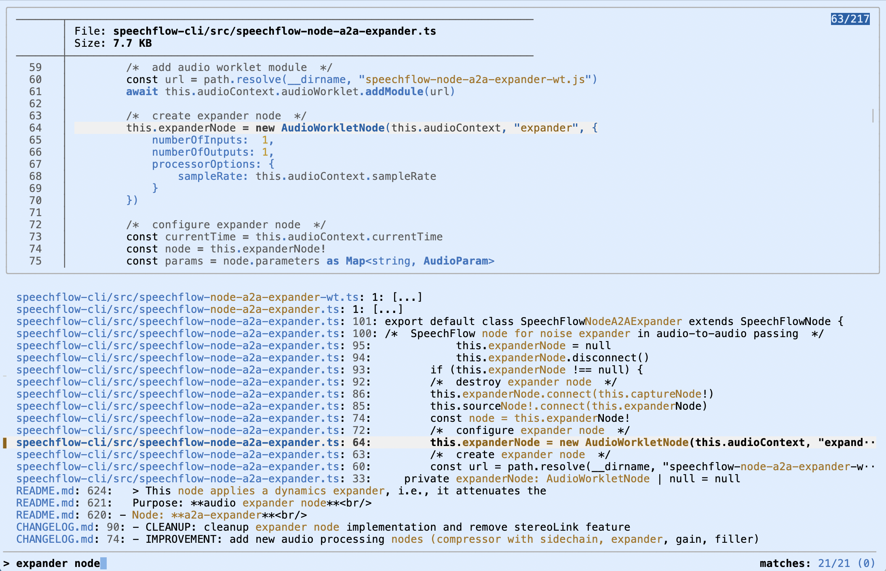

bash-sc
=======

### Search Content



About
-----

**sc(1)** This is a small [GNU Bash](https://www.gnu.org/software/bash/)
script which provides the capability to interactively search content on
the filesystem. It fuzzy matches query strings both in file contents
and file names. **sc(1)** internally is based on the excellent Unix
utilities [fzf(1)](https://github.com/junegunn/fzf/) for dialog control,
[rg(1)](https://github.com/BurntSushi/ripgrep) for content searching,
and [bat(1)](https://github.com/sharkdp/bat) for content previewing.

Usage
-----

Start the searching with...

```
sc [<query>]
```

...then enter a query from scratch or extend the query from the
command-line. Use cursor keys up/down for selecting the files, press
ENTER for editing the currently selected file in vim(1) and afterwards
terminate **sc(1)**, CTRL-E for editing the currently selected file in
vim(1) and afterwards return to the searching, or CTRL-O for editing
the currently selected file in Visual Studio Code (via code(1)) and
afterwards return to the searching. Alternatively, select more than one
file with TAB and then use ENTER, CTRL-E or CTRL-O for editing all the
currently selected files in vim(1) or Visual Studio Code.

License
-------

Copyright (c) 2025 Dr. Ralf S. Engelschall (http://engelschall.com/)

Permission is hereby granted, free of charge, to any person obtaining
a copy of this software and associated documentation files (the
"Software"), to deal in the Software without restriction, including
without limitation the rights to use, copy, modify, merge, publish,
distribute, sublicense, and/or sell copies of the Software, and to
permit persons to whom the Software is furnished to do so, subject to
the following conditions:

The above copyright notice and this permission notice shall be included
in all copies or substantial portions of the Software.

THE SOFTWARE IS PROVIDED "AS IS", WITHOUT WARRANTY OF ANY KIND,
EXPRESS OR IMPLIED, INCLUDING BUT NOT LIMITED TO THE WARRANTIES OF
MERCHANTABILITY, FITNESS FOR A PARTICULAR PURPOSE AND NONINFRINGEMENT.
IN NO EVENT SHALL THE AUTHORS OR COPYRIGHT HOLDERS BE LIABLE FOR ANY
CLAIM, DAMAGES OR OTHER LIABILITY, WHETHER IN AN ACTION OF CONTRACT,
TORT OR OTHERWISE, ARISING FROM, OUT OF OR IN CONNECTION WITH THE
SOFTWARE OR THE USE OR OTHER DEALINGS IN THE SOFTWARE.

